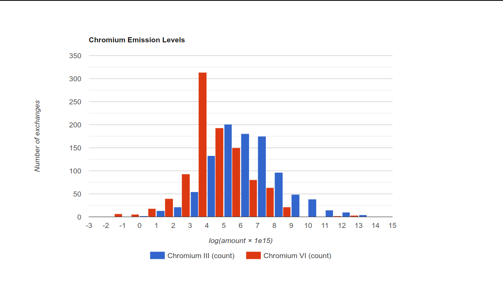

# Display a diagram with HTML

The following example shows how to display data in a diagram using HTML. In the example, all output
amounts of `Emission to air/unspecified/Chromium III` and `Emission to air/unspecified/Chromium VI`
are collected from a database, transformed with `f(x) = log10(x * 1e15)` to make a nice
distribution, and shown in a histogram using the
[Google Chart API](https://developers.google.com/chart/interactive/docs/gallery/histogram). An HTML
page is generated that is loaded in a SWT `Browser` in a separate window.

## Retrieving the flow

The flows `Chromium x` are retrieved from the database by iterating over all flows named
`Chromium x` and then iterating over the categories of the flow.

To get all the flows name `Chromium x`, we use the `FlowDao` class. DAO stands for Data Access
Object, it is a class that provides access to the database without running complex SQL queries.

Every entities of openLCA has a category attribute that is a reference to the parent category. A
category can also have a parent category. In this example, we use the category hierarchy to filter
the flows. For each chromium name (`Chromium VI`, `Chromium III`), the following code is run:

```python
def get_flow(name):  # type: (str) -> Flow
    """
    Get the flow `Emission to air / unspecified / Chromium ...` from the
    database.
    """
    flows = FlowDao(db).getForName(name)
    for flow in flows:
        c = flow.category
        if c is None or c.name != "unspecified":
            continue
        c = c.category
        if c is None or c.name != "Emission to air":
            continue
        return flow
```

## Collecting the results

The amount of the output exchange of every process is collected from the database by running a SQL
query. The query is run using the `NativeSql` class, which is a wrapper around the database
connection.

```python
def collect_amounts(flow):  # type: (Flow) -> List[float or str]
    results = [flow.name]

    def collect_results(record):
        results.append(math.log10(record.getDouble(1) * 1e15))
        return True

    print("Collecting results for {name}".format(**{"name": flow.name}))
    query = (
        "SELECT resulting_amount_value FROM tbl_exchanges WHERE f_flow = %i AND is_input = 0"
        % flow.id
    )
    NativeSql.on(db).query(query, collect_results)

    print("{size} results collected".format(**{"size": len(results) - 1}))

    return results
```

## Generating the HTML page

The HTML page is generated by injecting the results into a template.

Then, in order to display the page in a shell, we use the SWT `Browser` class. Yes! You can display
HTML pages in openLCA!

```python
def make_html(results):  # type: (List[List[float or str]]) -> str
    """Generate the HTML page for the data."""

    html = """<html>
    <head>
        <script type="text/javascript" src="https://www.gstatic.com/charts/loader.js"></script>
        <script type="text/javascript">
        google.charts.load("current", {packages:["corechart"]});
        google.charts.setOnLoadCallback(drawChart);
        function drawChart() {
            var data = google.visualization.arrayToDataTable(%s);

            var options = {
                title: 'Chromium Emission Levels',
                legend: { position: 'bottom' },
                hAxis: {
                    title: 'log(amount × 1e15)',
                    ticks: [%s]
                },
                vAxis: {
                    title: 'Number of exchanges'
                }
            };

            var chart = new google.visualization.Histogram(
                document.getElementById('chart_div')
            );
            chart.draw(data, options);
        }
        </script>
    </head>
    <body>
        <div id="chart_div" style="width: 900px; height: 500px;"></div>
    </body>
    </html>
    """ % (
        json.dumps(results),
        ", ".join(str(x) for x in range(-3, 16)),
    )
    return html
```

Finally, the HTML page is loaded in a SWT `Browser`:

```python
shell = Shell(Display.getDefault())
# set the window title
shell.setText("Chromium VI")
shell.setLayout(FillLayout())
browser = Browser(shell, SWT.NONE)
browser.setText(html)

shell.open()
```

To see the result, copy and paste the [full script](html_diagram.py) in the openLCA Python console
in an opened ecoinvent database.

With ecoinvent 3.10.1 (APOS), the result looks like this:


