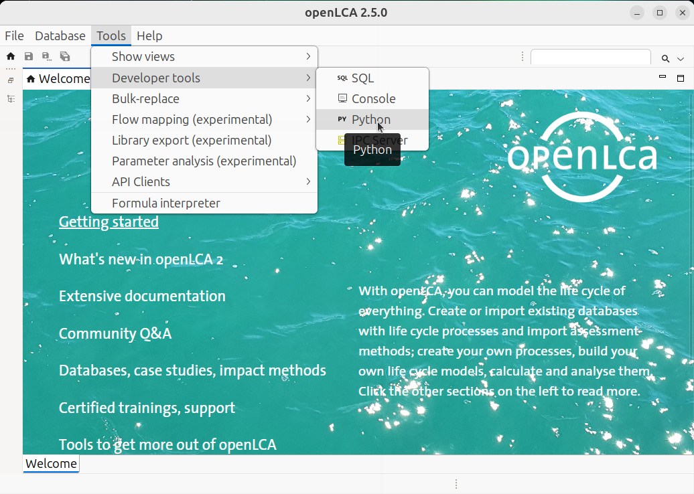
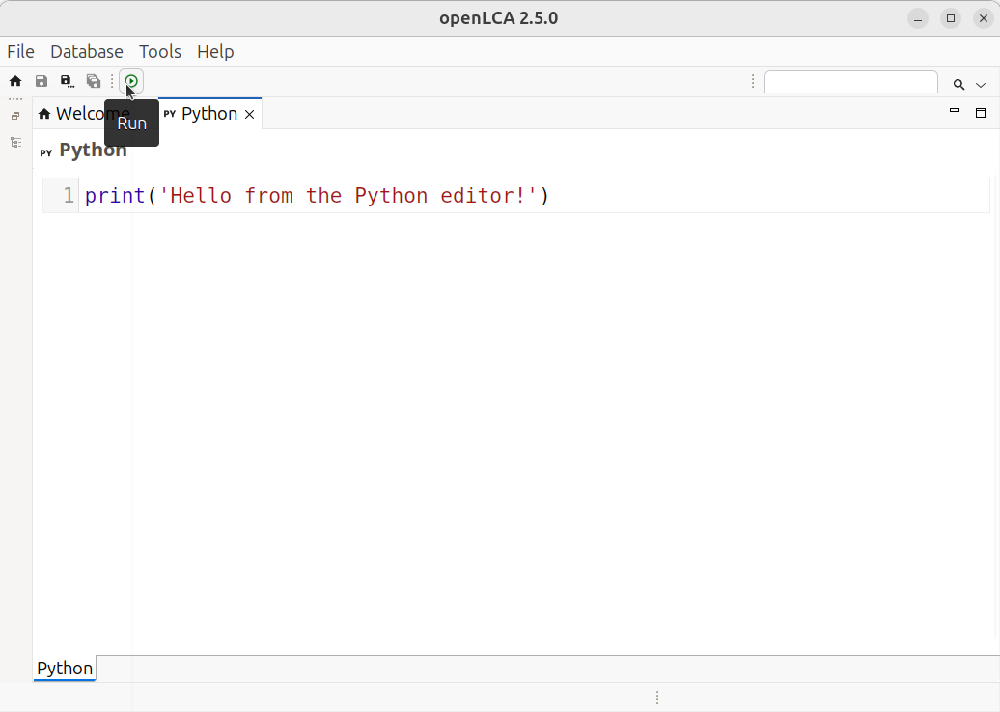
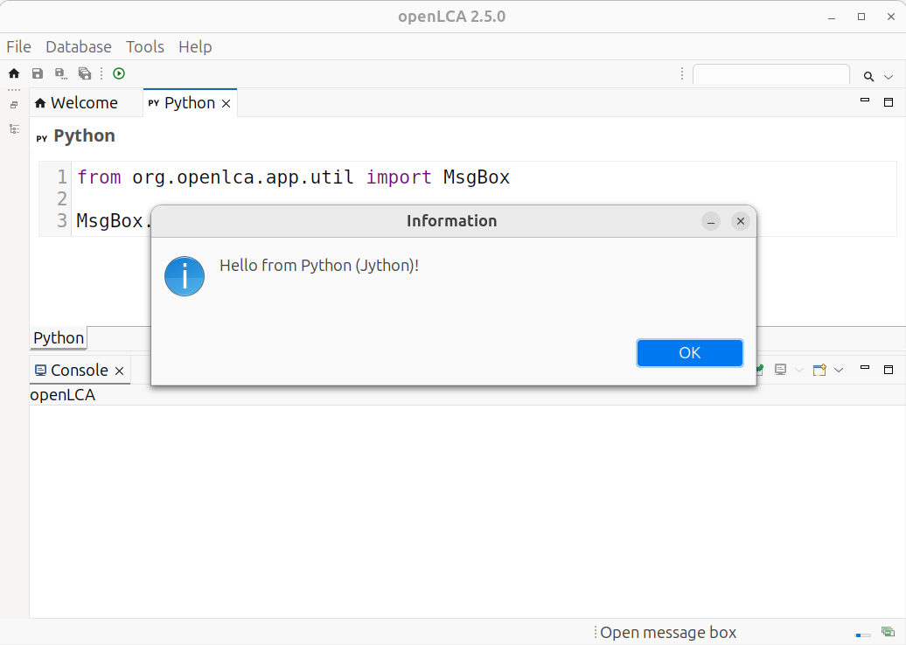

# Introduction

Welcome to the world of scripting in [openLCA](https://github.com/GreenDelta/olca-app)! Since
openLCA is a Java-based application running on the Java Virtual Machine (JVM), it comes with a
powerful tool for automation and customization: [Jython](http://www.jython.org/). Jython is an
implementation of Python 2.7 that seamlessly integrates with Java, compiling Python code into Java
bytecode for execution on the JVM.

The best part? openLCA comes pre-packaged with Jython 2.7, so you are ready to start scripting right
away! Just head over to `Tools → Developer Tools → Python`, where you will find a built-in Python
editor. There, you can write and execute scripts to automate tasks, extend functionalities, or
simply experiment with the power of Python inside openLCA.

Let’s dive in and unlock the full potential of openLCA with Jython!



In order to execute a script, you click on the `Run` button in the toolbar of the Python editor:



## Hello world!

As said above, you can write Python code in the Python editor and execute it. Let's start with the
holy grail of coding tutorials: _Hello world!_

```python
print("Hello world!")
```

When running this line of code, the openLCA console should appear with the message "Hello world!"



## Relation to standard Python

As said above, Jython runs on the JVM. It implements a great part of the Python 2.7 standard library
for the JVM. For example the following script will work when you set the file path to an existing
CSV file on your system:

```python
import csv

# Do not forget to edit this path to point to your CSV file!
FILE = "~/path/to/file.csv"
data = [
    ["Tea", "1.0"],
    ["Coffee", "2.0"],
]

with open(FILE, "w") as file:
    writer = csv.writer(file)
    for r in data:
        writer.writerow(r)
```

The Jython standard library is extracted to the `python` folder of the openLCA workspace which is by
default located in your user directory `~/openLCA-data-1.4/python`. This is also the location in
which you can put your own Jython 2.7 compatible modules. For example, when you create a file
`tutorial.py` with the following function in this folder:

```python
# ~/openLCA-data-1.4/python/tutorial.py
def the_answer():
    return 42
```

You can then load it in the openLCA script editor:

```python
import tutorial
import org.openlca.app.util.MsgBox as MsgBox

MsgBox.info("The answer is %s!" % tutorial.the_answer())
```

An **important thing** to note is that Python modules that use C-extensions (like NumPy and friends)
or parts of the standard library that are not implemented in Jython are **not** compatible **with
Jython**. If you want to interact from standard CPython with openLCA (using Pandas, NumPy, etc.)
**you can use** the [openLCA IPC Python API](https://greendelta.github.io/openLCA-ApiDoc/).

## The openLCA API

As said above, with Jython you directly access the openLCA Java API. In Jython, you interact with a
Java class in the same way as with a Python class. The openLCA API starts with a set of classes that
describe the basic data model, like `Flow`, `Process`, `ProductSystem`. You can find these classes
in the
[olca-module repository](https://github.com/GreenDelta/olca-modules/tree/master/olca-core/src/main/java/org/openlca/core/model).

More information in the [The basic data model](../user_guide/data_model/basic_data_model.md)
chapter.
