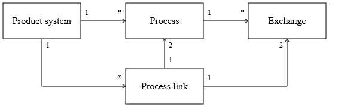

# The basic data model

The basic data model of openLCA is defined in the package `org.openlca.core.model` of the
[olca-core module](https://github.com/GreenDelta/olca-modules/tree/master/olca-core). When you work
with data in openLCA you will usually interact with the types of this package. In this section, we
describe the basic data types and how they are related to each other. Each type is basically a Java
class which you can access like a normal Python class from Jython.

Note that we will not describe all types of the openLCA model and we will focus on the most
important properties.

> **_NOTE:_** You can run the following lines of code by copy-pasting them in the openLCA Python
> console. You can also copy the whole [script](basic_data_model.py).

## The basic inventory model

The openLCA data model is built around a basic inventory model which has the following components:



In this model, processes are the basic building blocks that describe the production of a material or
energy, treatment of waste, provision of a service, etc. Each process has a set of exchanges that
contain the inputs and outputs of flows like products, wastes, resources, and emissions of that
process. The product and waste flows can be linked in a product system to specify the supply chain
of a product or service: the functional unit of that product system. Such product systems are then
used to calculate inventory and impact assessment results.

## Units and unit groups

All quantitative amounts of the inputs and outputs in a process have a unit of measurement. In
openLCA convertible units are organized in groups that have a reference unit to which the conversion
factors of the units are related:

```python
class Unit:
    name: str
    description: str
    conversionFactor: float

    synonyms: str
    ...


class UnitGroup:
    name: str
    description: str
    referenceUnit: Unit
    units: List[Unit]

    defaultFlowProperty: FlowProperty
    ...
```

Units and unit groups can be created in the following way:

```python
kg = Unit.of("kg", 1.0)  # name: str, conversionFactor: float

units_of_mass = UnitGroup.of("Unit of mass", kg)  # name: str, referenceUnit: Unit
units_of_mass.units.add(kg)
```

## Flows and flow properties

Flows are the things that are moved around as inputs and outputs (exchanges) of processes. When a
process produces electricity and another process consumes electricity from the first process, both
processes will have an output exchange and input exchange with a reference to the same flow. The
basic type definition of a flow looks like this:

```python
class Flow:
    name: str
    description: str
    flowType: FlowType
    referenceFlowProperty: FlowProperty
    flowPropertyFactors: List[FlowPropertyFactor]

    formula: str
    location: Location
    infrastructureFlow: bool
    synonyms: str
    ...
```

### The flow type

The `flowType` property indicates whether the flow is a product, waste, or elementary flow. Product
and waste flows can link inputs and outputs of processes (like electricity) in a product system
where elementary flows (like CO₂) are the emissions and resources of the processes. Basically, in
the calculation the flow type is used to decide whether to put an exchange amount into the
technology matrix **A** or the intervention matrix **B** (see also the calculation section).

The type `FlowType` is an enumeration type with the following values:

- `PRODUCT_FLOW`,
- `ELEMENTARY_FLOW`,
- `WASTE_FLOW`.

When you create a flow, you can set the flow type in the following way:

```python
flow = Flow()
flow.flowType = FlowType.PRODUCT_FLOW
flow.name = "Liquid aluminium"
```

> **_NOTE:_** We will see in the [Processes](#processes) section a even easier way to create flows.

### Flow properties

A flow in openLCA has physical properties (like mass or volume), called flow properties, in which
the amount of a flow in a process exchange can be specified:

```python
class FlowProperty:
    name: str
    description: str
    refId: str
    flowPropertyType: FlowPropertyType
    unitGroup: UnitGroup
    ...
```

Like the `FlowType` the `FlowPropertyType` is an enumeration type and can have the following values:
`PHYSICAL` and `ECONOMIC`. The flow property type is basically only used when physical and economic
allocation factors of a process are calculating automatically. With this, a flow property can be
created in the following way:

```python
mass = FlowProperty()
mass.flowPropertyType = FlowPropertyType.PHYSICAL
mass.unitGroup = units_of_mass

# the same operation can be done using the FlowProperty.of method as the
# default flow property type is PHYSICAL
mass = FlowProperty.of("Mass", units_of_mass)  # name: str, unitGroup: UnitGroup
```

For a flow, all flow properties need to be convertible by a factor which is defined by the type
`FlowPropertyFactor`:

```python
class FlowPropertyFactor:
    conversionFactor: float
    flowProperty: FlowProperty
    ...
```

These conversion factors are related to the reference flow property (`referenceFlowProperty`) of the
flow:

```python
flow.referenceFlowProperty = mass
massFactor = FlowPropertyFactor.of(mass, 1.0)  # prop: FlowProperty, factor: float
flow.flowPropertyFactors.add(massFactor)
```

## Processes

A process describes the inputs and outputs (exchanges) related to a quantitative reference which is
typically the output product of the process:

```python
class Process:
    name: str
    description: str
    refId: str
    quantitativeReference: Exchange
    exchanges: List[Exchange]

    defaultAllocationMethod: AllocationMethod
    allocationFactors: List[AllocationFactor]
    processType: ProcessType
    location: Location
    documentation: ProcessDoc
    infrastructureProcess: bool
    socialAspects: List[SocialAspect]
    dqSystem: DQSystem
    socialDqSystem: DQSystem
    ...
```

An input or output is described by the type `Exchange` in openLCA:

```python
class Exchange:
    input: bool
    flow: Flow
    unit: Unit
    amountValue: float

    defaultProviderId: long
    formula: str
    uncertainty: Uncertainty
    baseUncertainty: float
    dqEntry: str
    cost: float
    costFormula: str
    currency: Currency
    isAvoided: bool
    ...
```

The `Boolean` property `input` indicates whether the exchange is an input (`True`) or not (`False`).
Each exchange has a flow (like steel or CO₂), unit, and amount but also a flow property factor which
indicates the physical quantity of the amount (note that there are different physical quantities
that can have the same unit). The following example shows how we can create a process and define its
quantitative reference as a product output:

```python
output = Flow.product("Molten aluminium", mass)  # name: str, flowProperty: FlowProperty
# create a process with `output` as quantitative reference with the default amount of 1.0
process = Process.of("Aluminium smelting", output)
```

To add inputs to the process, we create a flow (here a waste flow) and add it to the process as
follows:

```python
waste = Flow.waste(
    "Spent Pot Lining (SPL)", mass
)  # name: str, flowProperty: FlowProperty
process.input(waste, 4.2)  # flow: Flow, amount: float
```

## Product systems

A product system describes the supply chain of a product (the functional unit).

```python
class ProductSystem:
    name: str
    description: str
    refId: str
    processes: List[Process]
    referenceProcess: Process
    quantitativeReference: Exchange
    targetAmount: float
    targetUnit: Unit
    targetFlowPropertyFactor: FlowPropertyFactor

    processLinks: List[ProcessLink]
    referenceExchange: Exchange
    parameterSets: List[ParameterRedefSet]
    cutoff: float
    analysisGroups: List[AnalysisGroup]
    ...
```

A product system can be created from an existing process in the following way:

```python
system = ProductSystem.of("Aluminium smelting", process)
# name: str, process: Process
```

The `process` is added to the list of `processes` of the product system, the reference process is
set to the process, and the quantitative reference is set to the output exchange of the process. The
`target` attributes are also set using the `process` attributes.

To insert all the datasets in the database, you can use the `db.insert` method. Please note that the
order of the arguments is important: they are ordered by dependencies.

```python
db.insert(units_of_mass, mass, flow, output, waste, process, system)
```

However, the product system created with this method is not yet linked to any provider. To do so,
refer to the following [section](product_system.md).

## Impact methods

An impact method is used to translate environmental flows (like emissions and resource use) into
potential environmental impacts, such as climate change or human toxicity.

```python
class ImpactMethod:
    name: str
    description: str
    refId: str
    code: str  # e.g. "EF 3.0" for Environmental footprint 3.0
    impactCategories: List[ImpactCategory]
    nwSets: List[NWSet]

    source: Source
    ...
```

An impact category is a collection of impact factors that are used to calculate the potential
environmental impact of an exchange:

```python
class ImpactCategory:
    name: str
    description: str
    refId: str
    code: str  # e.g. "GWP" for Global Warming Potential
    impactFactors: List[ImpactFactor]
    referenceUnit: str

    direction: Direction
    ...
```

```python
class ImpactFactor:
    flow: Flow
    value: float
    flowPropertyFactor: FlowPropertyFactor
    unit: Unit

    formula: str
    uncertainty: Uncertainty
    location: Location
    ...
```

For the sack of completeness, the following example shows how to create an impact method with impact
categories. Note that in general you will not need to create impact methods and impact categories in
Python. You will rather get the impact methods from the method package.

```python
bromopropane = Flow.product("Bromopropane", mass)
butane = Flow.product("Butane", mass)
impact_category = ImpactCategory.of(
    "Climate change", "kg CO2-Eq"
)  # name: str, referenceUnit: str
impact_category.factor(bromopropane, 0.052)  # flow: Flow, value: float
impact_category.factor(butane, 0.006)  # flow: Flow, value: float

impact_method = ImpactMethod.of("EF 3.0")  # name: str
impact_method.add(impact_category)
```
