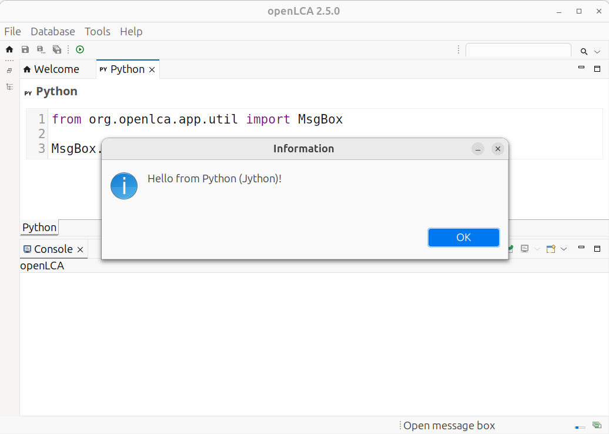

# Interacting with the openLCA UI

The script is executed in the same Java process as openLCA. Thus, you have access to all the things
that you can do with openLCA via this scripting API (and also to everything that you can do with the
Java and Jython runtime). Here is a small example script that will show the information message box
when you execute it in openLCA:

```python
from org.openlca.app.util import MsgBox

MsgBox.info("Hello from Python (Jython)!")
```


